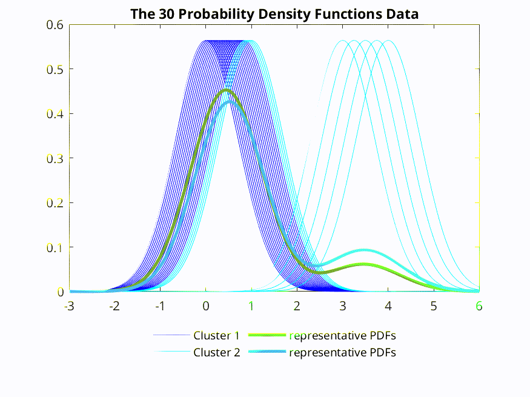

[](https://github.com/hungtrannam/Possibilistic-clustering-for-PDF/graphs/contributors)

# PCF ToolBox for clustering the probability density functions&reg;


[](https://matlab.mathworks.com/open/github/v1?repo=UniprJRC/FSDA&project=FSDA.prj)
[](https://www.gnu.org/software/octave/)


## 🌟 Overview

**PCF** is a MATLAB module for paper **A new possibilistic-based clustering method for probability density functions and its application to detecting abnormal elements**.

The project was started in 2023 by authors of Hung Tran-Nam, Thao Nguyen-Trang, and Ha Che-Ngoc.

Comprehensive detail of all functions is provided in the [PDF-format manual](https://github.com/hungtrannam/Possibilistic-clustering-for-PDF/blob/main/PCF-manual.pdf).


Advantages of the Toolbox are that:

* the code is mature and provides a point of comparison for other implementations of the same algorithms;
* the routines are generally written in a straightforward manner which allows for easy understanding, perhaps at the expense of computational efficiency. If you feel strongly about computational efficiency then you can always rewrite the function to be more efficient, compile the M-file using the MATLAB compiler, or create a MEX version;
* source code is available for the benefit for understanding and teaching.


## 🛠️ Installation

### Add-On installation
* From the MATLAB toolstrip ```Home > Add-Ons > Get Add-Ons``` will bring up the ```Add-On Explorer```.
* Enter *"PCF clustering"* into the search box, select the first entry and then click *"Add from GitHub"*.
* The Toolbox will be downloaded and added to your path.

### Manual installation

To install the toolbox:
* download the zip archive of the latest release or type the following to the terminal:

```sh
git clone http://hungtrannam/Possibilistics-clustering-for-PDF
```

* unzip the file
* add the 'PCF' directory to the Matlab path (see the "addpath" function from Matlab).


The functions should work fine with `Octave 8.4.x`. However, we should install the ```statistics``` package from Octave. To load the package, run from the Octave prompt the following.

```Octave
pkg install -forge statistics
pkg install -forge fuzzy-logic-toolkit
```

## ▶️ Runing

### Usage

1. **Script Execution:**
   - Open the MATLAB environment.
   - Run the script `PCF_main.m`.

2. **Expected Outputs:**
   - Heatmap visualization of cluster memberships.
   - Overlay plot of probability density functions (PDF) and representative PDF.
   - Validation metrics for cluster quality.

### File Structure

- **Data**: Contains functions for data simulation (`SimPDFAbnormal`).
- **Figure_Output**: Directory for saving generated figures.
- **Package/Clust**: Clustering algorithms (`PCM_`).
- **Package/Vis**: Visualization utilities (`PlotPDFeachIteration`).
- **Package/Val**: Validation functions (`validityClustering`).
- **Package/ToolBox**: Additional tools and utilities.

### Parameters and Settings

- **Data Simulation:** Generates data with abnormal parameters defined in `abnormal_params`.
- **Clustering Settings:** Parameters for PCM, including maximum iterations (`maxIter`), fuzziness (`mFuzzy`), convergence criteria (`epsilon`), number of clusters (`kClust`), and validation parameters.

### Simulation



**Step 1**: Install `ffmpeg`
First, you need to install `ffmpeg` if you haven't already. Open the Terminal and run the following commands
```sh
sudo apt update
sudo apt install ffmpeg
```
Step 2: Create a GIF from a Sequence of Output PNG Images

```sh
ffmpeg -framerate 1 -i CDF_Plot\(%03d\).png output.gif
```

### Dependencies

🤖 MATLAB R2020a or later.

🤖 Octave GNU 8.4.0 or later.

🤖 Additional packages and functions as specified in the `addpath` section.

### Example Use Cases

Provide examples of how the PCF Toolbox can be used in practical scenarios. This can help users understand the application of the toolbox:

Example 1: Detecting Anomalies in Financial Data

* Simulate financial data using SimPDFAbnormal.
* Apply the PCF clustering algorithm to identify unusual patterns.
* Visualize the results with heatmaps and overlay plots.

Example 2: Medical Data Analysis

* Use the toolbox to cluster patient data based on probability density functions.
* Identify outliers and abnormal cases in medical diagnostics.

## 📖 Citing
If you use this repository in your research or work, please cite the following paper:
```
Tran-Nam, H., Nguyen-Trang, T. & Che-Ngoc, H. A new possibilistic-based clustering method for probability density functions and its application to detecting abnormal elements. Sci Rep 14, 17871 (2024). https://doi.org/10.1038/s41598-024-68323-9
```


## 🙋‍♂️ FAQ

### 1. What platforms does the PCF Toolbox support?

The PCF Toolbox is primarily designed to work with MATLAB (R2020a or later) and Octave (GNU 8.4.0 or later). Ensure that all required packages mentioned in the dependencies section are installed for smooth operation.

### 2. How can I contribute to the PCF Toolbox?

We welcome contributions to the PCF Toolbox! Please fork the repository, make your changes, and submit a pull request. Make sure to follow the contribution guidelines outlined in the repository.

### 3. Where can I find the manual for the Toolbox?

The PDF-format manual for the PCF Toolbox is available [here](https://github.com/hungtrannam/Possibilistics-clustering-for-PDF/blob/main/PCF-manual.pdf). It contains comprehensive details on all functions and usage instructions.

### 4. How do I report a bug or suggest a feature?

You can report bugs, suggest features, or start a discussion by creating a new issue [here]([link_to_issues](https://github.com/hungtrannam/Probabilistics-clustering-for-PDF/issues)).

### 5. Can I use the PCF Toolbox for commercial purposes?

Yes, the PCF Toolbox is licensed under [CC-BY-4.0](https://creativecommons.org/licenses/by/4.0/), which allows for both personal and commercial use with proper attribution.


## ✉️ Contact

If you have any questions, bug reports, comments, code contribtions, or constructive discussions, please contact us at:

✉️ E-mail: hung.trannam@vlu.edu.vn for questions, comments, and code contribtions

✉️ Create new issue in [issues](https://github.com/hungtrannam/Possibilistic-clustering-for-PDF/issues) for constructive discussions and bug reports


-----------

[](https://creativecommons.org/licenses/by/4.0/)

Copyright &copy; 2024, The MathWorks, Inc.


